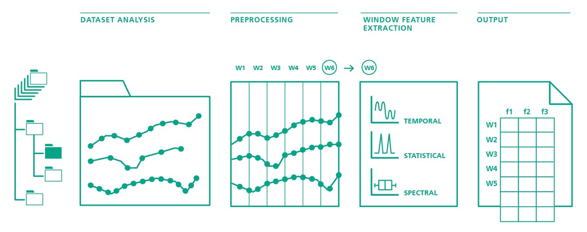

===========
Get Started
===========

In this page we will summarize the main features of TSFEL using a concrete example.

Overview
--------

Time series are passed as inputs for the main TSFEL extraction method either as arrays previously loaded in memory or stored in files on a dataset. Since TSFEL can handle multidimensional time series, a set of preprocessing methods is afterwards applied to ensure that not only the signal quality is adequate, but also, time series synchronisation, so that the window calculation process is properly achieved. After the feature extraction, the result is saved using a standard schema ready to be digested by most of the classification and data mining platforms. Each line corresponds to a window with the results of the feature extraction methods stored along the corresponding columns.

Extract from time series as array objects
-----------------------------------------

Let us start by downloading a some data. A complete dataset description can be found in [1]_. On this example we will use a time series sampled by an accelerometer sensor at 50 Hz.

.. code:: python

    import tsfel
    import zipfile
    import numpy as np
    import pandas as pd

    # Load the dataset from online repository
    # !wget https://archive.ics.uci.edu/ml/machine-learning-databases/00240/UCI%20HAR%20Dataset.zip

    # Unzip the dataset
    zip_ref = zipfile.ZipFile("UCI HAR Dataset.zip", 'r')
    zip_ref.extractall()
    zip_ref.close()

    # Store the dataset as a Pandas dataframe.
    x_train_sig = np.loadtxt('UCI HAR Dataset/train/Inertial Signals/total_acc_x_train.txt', dtype='float32')
    X_train_sig = pd.DataFrame(np.hstack(x_train_sig), columns=["total_acc_x"])

Let us look to the data structure:

.. code:: python

    X_train_sig.head()

=====  ===========
Id     total_acc_x
-----  ----------- 
0      1.012817  
1      1.022833  
2      1.022028   
3      1.017877
4      1.023680
=====  ===========

We have now a DataFrame composed by a unique column with associated column name. Note that TSFEL can also handle multidimensional datastreams. In that case, it will be necessary to pass the additional time series as additional collumns in the dataframe.

Now that we have the input data we are ready for the feature extraction step. TSFEL relies on dictionaries to setup the configuration of the extractly. We provide a set of template configuration dictionaries that can be used out of the box. In this example we will use the example that extracts all the available features of TSFEL. We will configure TSFEL to divide our time series in windows of equal length of size 250 points (corresponding to 5 seconds).

.. code:: python

    cfg_file = tsfel.get_all_features()
    windows = tsfel.signal_window_spliter(X_train_sig, 250, 0)
    X_train = tsfel.time_series_features_extractor(cfg_file, windows, fs=50)

We finnaly have now X_train as the final feature vector composed by 205 features calculated for each of the 3764 extracted windows.

Extract from time series stored in datasets
-------------------------------------------
TBD 

.. [1] `https://archive.ics.uci.edu/ml/datasets/human+activity+recognition+using+smartphones <https://archive.ics.uci.edu/ml/datasets/human+activity+recognition+using+smartphones>`_. 

