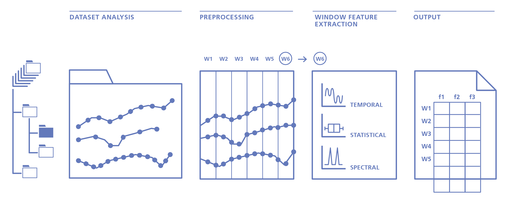

===========
Get Started
===========

Overview
--------

Time series are passed as inputs for the main TSFEL extraction method, either as arrays previously loaded in memory or stored in files on a dataset. Since TSFEL can handle multidimensional time series, a set of preprocessing methods is afterwards applied to ensure that the signal quality is adequate and time series synchronisation so that the window calculation process is properly achieved. After the feature extraction, the result is saved using a standard schema ready to be digested by most of the classification and data mining platforms. Each line corresponds to a window with the results of the feature extraction methods stored along with the corresponding columns.

Extract from time series as array objects
-----------------------------------------

Let us start by downloading some data. A complete dataset description can be found in [1]_. On this example we will use a time series sampled by an accelerometer sensor at 50 Hz.

.. code:: python

    import tsfel
    import zipfile
    import numpy as np
    import pandas as pd

    # Load the dataset from online repository
    !wget https://archive.ics.uci.edu/ml/machine-learning-databases/00240/UCI%20HAR%20Dataset.zip

    # Unzip the dataset
    zip_ref = zipfile.ZipFile("UCI HAR Dataset.zip", 'r')
    zip_ref.extractall()
    zip_ref.close()

    # Store the dataset as a Pandas dataframe.
    x_train_sig = np.loadtxt('UCI HAR Dataset/train/Inertial Signals/total_acc_x_train.txt', dtype='float32')
    X_train_sig = pd.DataFrame(np.hstack(x_train_sig), columns=["total_acc_x"])

Let us look to the data structure:

.. code:: python

    X_train_sig.head()

=====  ===========
Id     total_acc_x
-----  -----------
0      1.012817
1      1.022833
2      1.022028
3      1.017877
4      1.023680
=====  ===========

We have now a DataFrame composed by a unique column with associated column name. Note that TSFEL can also handle multidimensional datastreams. In that case, it will be necessary to pass the additional time series as additional columns in the dataframe.

Now that we have the input data we are ready for the feature extraction step. TSFEL relies on dictionaries to setup the configuration of the extractly. We provide a set of template configuration dictionaries that can be used out of the box. In this example we will use the example that extracts all the available features of TSFEL. We will configure TSFEL to divide our time series in windows of equal length of size 250 points (corresponding to 5 seconds).

.. code:: python

    cfg_file = tsfel.get_features_by_domain()                                                        # If no argument is passed retrieves all available features
    X_train = tsfel.time_series_features_extractor(cfg_file, X_train_sig, fs=50, window_size=250)    # Receives a time series sampled at 50 Hz, divides into windows of size 250 (i.e. 5 seconds) and extracts all features

We finally have now ``X_train`` as the final feature vector composed of 205 features calculated for each of the 3764 extracted windows.

Extract from time series stored in datasets
-------------------------------------------

In the previous section, we observed how TSFEL can be used for feature extraction on time series stored in memory. The process of training machine learning models requires significant amounts of data. Time series datasets are often organised in a multitude of different schemas defined by the entities who collected and curated the data.
TSFEL provides a method to increase flexibility when extracting features over multiple files stored in datasets. We provide below a list of assumptions when using this method and how TSFEL handles it:

* **Time series are stored on different file locations**

  * TSFEL crawls over a given dataset root directory and extracts features from all text files which match filenames provided by the user

* **Files store time series in delimited format**

  * TSFEL expects that the first column must contain the timestamp and following columns contain the time series values.

* **Files might not be syncronised in time**

  * TSFEL handles this assumption by conducting a linear interpolation to ensure all the time series are syncronised in time before feature extraction. The resampling frequency is set by the user.

The following code block extracts features on data residing over ``main_directory``, from all files named ``Accelerometer.txt``. Timestamps were recorded in nanoseconds and the resampling frequency is set to 100 Hz.

.. code:: python

  import tsfel

  main_directory = '/my_root_dataset_directory/'        # The root directory of the dataset
  output_directory = '/my_output_feature_directory/'    # The resulted file from the feature extraction will be saved on this directory

  data = tsfel.dataset_features_extractor(
                        main_directory, tsfel.get_features_by_domain(), search_criteria="Accelerometer.txt",
                        time_unit=1e-9, resample_rate=100, window_size=250,
                        output_directory=output_directory
         )

Set up the feature extraction config file
------------------------------------------
One of the main advantages of TSFEL is providing a large number of time series features out-of-the-box. Nevertheless, there are occasions where you might not be interested in extracting the complete set. Examples comprise scenarios where the models will be deployed in low-power embedded devices, or you simply want to be more specific in what features are extracted.

TSFEL divides the available features into three domains: statistical, temporal and spectral. The two methods to extract features explained above expect a configuration file - ``feat_dict`` - a dictionary containing which features and hyperparameters will be used.

Bellow, we list four examples to set up the configuration dictionary.

.. code:: python

  import tsfel

  cfg_file = tsfel.get_features_by_domain()               # All features will be extracted.
  cgf_file = tsfel.get_features_by_domain("statistical")  # All statistical domain features will be extracted
  cgf_file = tsfel.get_features_by_domain("temporal")     # All temporal domain features will be extracted
  cgf_file = tsfel.get_features_by_domain("spectral")     # All spectral domain features will be extracted

In case you want a customised set of features or a combination of features from several domains, you can need to edit the configuration dictionary (JSON). You must edit the value of the key ``use`` to ``yes`` or ``no`` as appropriate. You can load any of the previous configuration dictionaries and set to ``"use": "no"`` the features you are not interested in or edit a dictionary manually or programmatically and set the ``use`` as ``yes`` or ``no`` as appropriate. An example file is available  `here <https://github.com/fraunhoferportugal/tsfel/blob/development/tsfel/feature_extraction/features.json/>`_.

References
----------

.. [1] `https://archive.ics.uci.edu/ml/datasets/human+activity+recognition+using+smartphones <https://archive.ics.uci.edu/ml/datasets/human+activity+recognition+using+smartphones>`_.
