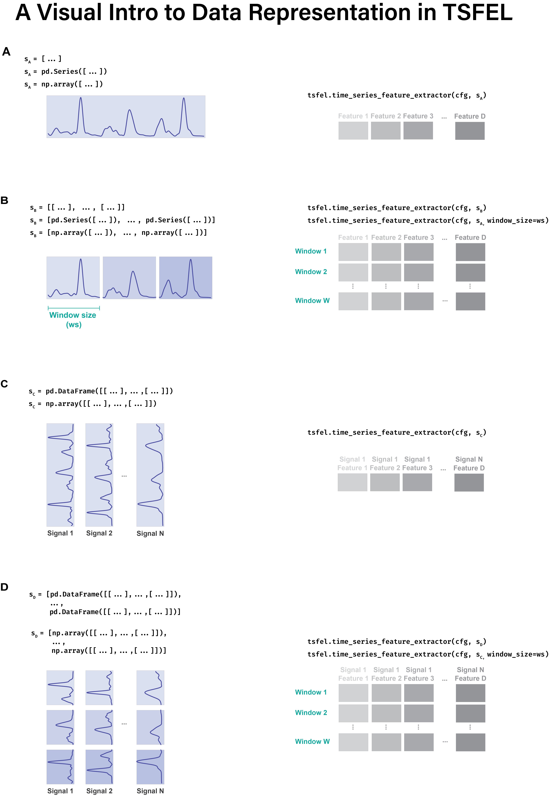
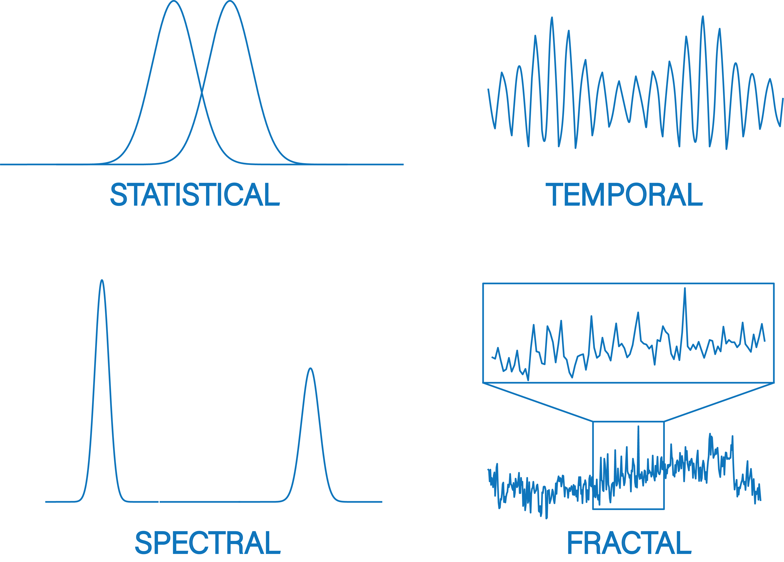

===========
Get Started
===========

``TSFEL`` is a simple yet powerful package for time series feature extraction. This page summarizes the key points to help you get started with using ``TSFEL`` for your feature extraction tasks. We begin by presenting the input data types, window splitting configurations, and the output data structure. Finally, we describe the available feature sets and important aspects of feature extraction configuration.

Extract from time series stored in DataFrames, Series or ndarrays
-----------------------------------------------------------------

Let's start by downloading some data. The following method returns a single-lead electrocardiogram (ECG) recorded at 100 Hz for a duration of 10 seconds.

.. code:: python

    import tsfel
    import pandas as pd

    data = tsfel.datasets.load_biopluxecg()    # A single-lead ECG collected during 10 s at 100 Hz.

Let us look to the input data structure:

.. code:: python

    data.head()
    0    2.898565
    1    2.462342
    2    -0.513560
    3    -5.263333
    4    -8.934970
    dtype: float64

Our input data is a ``Series`` named *LeadII*. Note that ``TSFEL`` can also handle multivariate time series. In such cases, you will need to include the additional time series as a ``DataFrame`` or ``ndarray``.

Now that we have the input data, we are ready for the feature extraction step. ``TSFEL`` relies on JSON configuration files to set up the configuration for feature extraction. We provide a set of template JSON configurations that can be used out of the box to extract all or individual feature sets.

In this example, we will use the configuration that extracts all available features from the temporal, statistical, and spectral sets.

.. code:: python

    cfg = tsfel.get_features_by_domain() # Extracts the temporal, statistical and spectral feature sets.
    X = tsfel.time_series_feature_extractor(cfg, data, fs=100)
    X.shape    # (1, 165)

We now have ``X`` as the extracted feature vector, composed of 165 features calculated for the entire length of the input data.

Alternatively, if we are interested in performing window splitting before the feature extraction, we can divide the input data into shorter 10 equal-length windows of size 100 (corresponding to 1 second).

.. code:: python

    cfg = tsfel.get_features_by_domain()    # Extracts the temporal, statistical and spectral feature sets.
    X = tsfel.time_series_feature_extractor(cfg, data, fs=100, window_size=100)    # Performs window splitting before feature extraction
    X.shape    # (10, 165)

Extract from time series stored in datasets
-------------------------------------------

In the previous section, we observed how TSFEL can be used for feature extraction on time series stored in memory. The process of training machine learning models requires significant amounts of data. Time series datasets are often organised in a multitude of different schemas defined by the entities who collected and curated the data.
TSFEL provides a method to increase flexibility when extracting features over multiple files stored in datasets. We provide below a list of assumptions when using this method and how TSFEL handles it:

* **Time series are stored on different file locations**

  * TSFEL crawls over a given dataset root directory and extracts features from all text files which match filenames provided by the user

* **Files store time series in delimited format**

  * TSFEL expects that the first column must contain the timestamp and following columns contain the time series values.

* **Files might not be syncronised in time**

  * TSFEL handles this assumption by conducting a linear interpolation to ensure all the time series are syncronised in time before feature extraction. The resampling frequency is set by the user.

The following code block extracts features on data residing over ``main_directory``, from all files named ``Accelerometer.txt``. Timestamps were recorded in nanoseconds and the resampling frequency is set to 100 Hz.

.. code:: python

  import tsfel

  main_directory = '/my_root_dataset_directory/'        # The root directory of the dataset
  output_directory = '/my_output_feature_directory/'    # The resulted file from the feature extraction will be saved on this directory

  data = tsfel.dataset_features_extractor(
                        main_directory, tsfel.get_features_by_domain(), search_criteria="Accelerometer.txt",
                        time_unit=1e-9, resample_rate=100, window_size=250,
                        output_directory=output_directory
         )

Input data formats
------------------

``TSFEL`` offers flexibility concerning the datatypes and dimensions that specify the format of the time series data. It supports both univariate and multivariate series.

A time series is a series of real valued observations taken at successive equally spaced points in time. We usually define the total number of observations as *length*. Univariate series consists of a single variable evolving over time (e.g., the daily closing stock prices for a given company). Multivariate series are composed of several variables concurrently evolving over time and we usually refer to each variable as a *dimension*. For instance, the input data from an accelerometer that measures the tridimensional acceleration (x, y, and z) has 3 dimensions. Note we assume that all dimensions share the same sampling frequency.

``TSFEL`` supports time series stored in  ``ndarray``, ``Series`` and ``DataFrame`` . We provide below an intuitive visual guide that summarizes the supported input data types and dimensions.

.. _visual_guide:

    A visual intro to data representation in TSFEL.

Feature extraction relies on the ``time_series_feature_extractor`` method. Its base arguments are ``input_data``, which stores the time series data, and ``features_dict``, which contains the feature extraction configuration. Further explanation on feature extraction configuration is available :ref:`here <feature-config>`.

A univariate time series must be stored in one column with several rows of observations. The ``time_series_feature_extractor`` extracts features from the whole length of a time series (:numref:`visual_guide` A) or from shorter fixed-size windows (:numref:`visual_guide` B).

The several variables of multivariate time series must be stored in separate columns. Similarly, to the univariate case, ``time_series_feature_extractor`` extracts features from the whole length of a time series (:numref:`visual_guide` C) or from shorter fixed-size windows (:numref:`visual_guide` D).

Output data format
------------------

The output is always provided as a ``DataFrame`` object, with the results from different features along the columns. If the input is multivariate, the features from the various dimensions are horizontally stacked together. The rows correspond to the values extracted from the entire time series (or from the windows, in the case of window division).

.. list-table::
   :widths: 15 15 15 15 15 15 10
   :header-rows: 0

   * -
     - 0_feature_1
     - 0_feature_2
     - ...
     - 1_feature_1
     - 1_feature_2
     - ...
   * - Window / Time Series
     -
     -
     - ...
     -
     -
     - ...
   * - ...
     -
     -
     - ...
     -
     -
     - ...

Note: If the input is stored in a ``Series`` or ``DataFrame`` objects with column names, the prefixes 0_* and 1_* are replaced by the variable names (e.g., AccX_feature_1, AccY_feature_1).

Feature sets
------------

Our feature sets are divided according to the *temporal*, *statistical, spectral*, and *fractal* domains.

    The available feature sets in TSFEL - temporal, statistical, spectral and fractal.

**Temporal** features analyze the changes and patterns in data over time. They capture information such as trends, cycles, and temporal correlations, which are essential for understanding dynamic behaviors and predicting future values. Time-domain features sensitive to the ordering of observations are included in this set.

**Statistical** features summarize data using descriptive statistics. They include measures such as mean, variance, skewness, and kurtosis, providing a comprehensive overview of the data distribution, central tendency, dispersion, and shape. Features insensitive to the ordering of observations are included in this set.

**Spectral** features focus on the frequency domain of the data. By transforming data using techniques like Fourier or wavelet transforms, they reveal underlying periodicities, harmonics, and frequency components, which are crucial for identifying cyclical patterns and oscillations.

**Fractal** features describe the complexity and self-similarity of data across different scales. They are derived from fractal theory and include measures like fractal dimension, capturing the intricate patterns and irregularities that are often present in natural and complex systems.

The description of each feature is available :ref:`here <feature-list>`.

.. _feature-config:

Set up the feature extraction config file
------------------------------------------
``TSFEL`` provides a large number of time series features by default. However, there are occasions when you might not need to extract the complete feature set. Examples include scenarios where models will be deployed on low-power embedded devices or when you simply want to specify which features are extracted.

The ``TSFEL`` complete feature set includes features from the statistical, temporal, spectral, and fractal domains. Some features also have their own hyperparameters, such as the number of bins for the histogram or the wavelet family. Information regarding which features to extract and their hyperparameters is stored in a JSON feature configuration file.

We provide convenient methods to easily set up JSON configuration files to extract the complete feature set or feature sets related to individual domains. An example is provided below:

.. code:: python

  import tsfel

  cfg_file = tsfel.get_features_by_domain()               # All features will be extracted.
  cgf_file = tsfel.get_features_by_domain("statistical")  # All statistical domain features will be extracted
  cgf_file = tsfel.get_features_by_domain("temporal")     # All temporal domain features will be extracted
  cgf_file = tsfel.get_features_by_domain("spectral")     # All spectral domain features will be extracted
  cgf_file = tsfel.get_features_by_domain("fractal")      # All fractal domain features will be extracted

To create a customized set of features, you need to edit the JSON feature configuration file accordingly by setting the value of the ``use`` key to ``yes`` or ``no`` as appropriate. Some feature extractors also have a ``parameter`` key to configure individual settings. An example file is available `here <https://github.com/fraunhoferportugal/tsfel/blob/development/tsfel/feature_extraction/features.json/>`_.

Usage example
-------------

We provide an `example notebook <https://colab.research.google.com/github/fraunhoferportugal/tsfel/blob/master/notebooks/TSFEL_HAR_Example.ipynb>`_ that summarizes the complete development stack using ``TSFEL``, including feature extraction, modeling, and model evaluation applied to a Human Activity Recognition (HAR) dataset.
